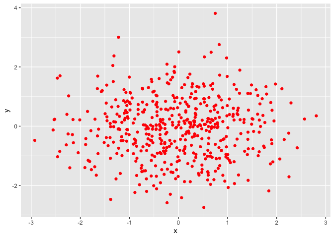
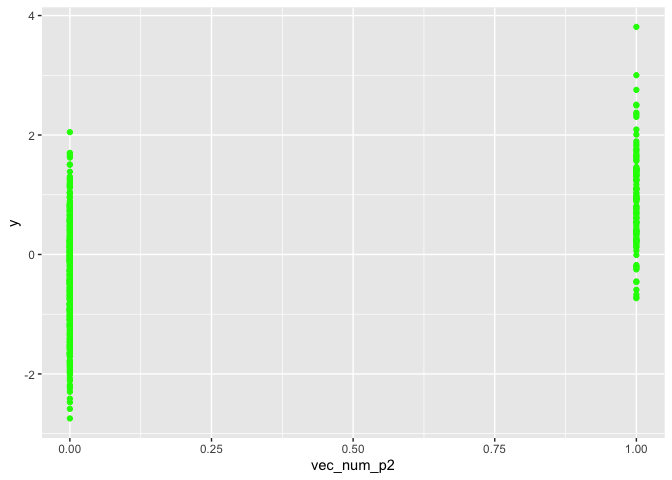
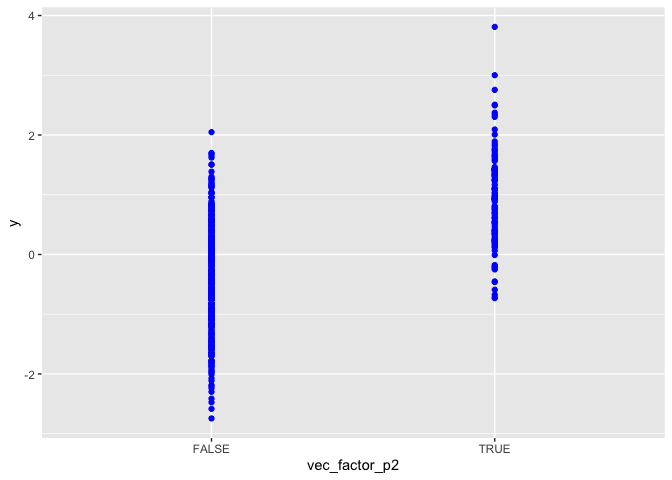

p8105\_hw1\_unp2000
================

# Problem 1:

Create a data frame comprised of: a random sample of size 8 from a
standard Normal distribution a logical vector indicating whether
elements of the sample are greater than 0 a character vector of length 8
a factor vector of length 8, with 3 different factor
    “levels”

``` r
library(tidyverse)
```

    ## ── Attaching packages ──────────────────────────────────────────────────────────────────── tidyverse 1.2.1 ──

    ## ✔ ggplot2 3.2.1     ✔ purrr   0.3.2
    ## ✔ tibble  2.1.3     ✔ dplyr   0.8.3
    ## ✔ tidyr   0.8.3     ✔ stringr 1.4.0
    ## ✔ readr   1.3.1     ✔ forcats 0.4.0

    ## ── Conflicts ─────────────────────────────────────────────────────────────────────── tidyverse_conflicts() ──
    ## ✖ dplyr::filter() masks stats::filter()
    ## ✖ dplyr::lag()    masks stats::lag()

``` r
hw1_df = tibble(
  norm_samp = rnorm(8),
  vec_logical = norm_samp > 0,
  vec_char = c("a", "b", "c", "d", "e", "f", "g", "h"),
  vec_factor = factor(c("small", "medium", "large", "medium", "small", "medium", "large", "large"))
)


##Try to take the mean of each variable in your dataframe. What works and what doesn’t?
mean(pull(hw1_df, norm_samp))
```

    ## [1] -0.1449175

``` r
mean(pull(hw1_df, vec_logical))
```

    ## [1] 0.5

``` r
mean(pull(hw1_df, vec_char))
```

    ## Warning in mean.default(pull(hw1_df, vec_char)): argument is not numeric or
    ## logical: returning NA

    ## [1] NA

``` r
mean(pull(hw1_df, vec_factor))
```

    ## Warning in mean.default(pull(hw1_df, vec_factor)): argument is not numeric
    ## or logical: returning NA

    ## [1] NA

I am able to take the mean for my norm\_sample (random sample of size 8
from a standard normal distribution) and vec\_logical (logical vector
indicating whether elements of the sample are greater than 0) variables
because they do contain numeric data. I am unable to take the mean for
vec\_char (character vector of length 8) and vec\_factor (factor vector
length 8, with 3 different factor “levels”) variables because they do
not completely contain numeric data.

``` r
as.numeric(pull(hw1_df, vec_logical))
as.numeric(pull(hw1_df, vec_char))
as.numeric(pull(hw1_df,vec_factor))
```

The as.numeric function converts variables that were written in my
logical, character, and factor vectors to numeric vectors. For my
logical and factor vectors, this does explain what happens when we take
the mean of both of these vectors. The logical vector converted the True
and False answers to Numbers (0 and 1) and my factor vector was
converted to numbers (3 = small, 2 = medium, 1 = large). The as.numeric
function was unable to convert my character vector into a numeric vector
because the variables listed were text. Because of this I was unable to
take a mean.

In a second code chunk: convert the logical vector to numeric, and
multiply the random sample by the result convert the logical vector to a
factor, and multiply the random sample by the result convert the logical
vector to a factor and then convert the result to numeric, and multiply
the random sample by the
    result

``` r
as.numeric(pull(hw1_df, vec_logical))*(pull(hw1_df,norm_samp))
```

    ## [1] 0.99032346 0.03526187 1.65827285 0.00000000 0.94114480 0.00000000
    ## [7] 0.00000000 0.00000000

``` r
as.factor(pull(hw1_df,vec_logical))*(pull(hw1_df,norm_samp))
```

    ## Warning in Ops.factor(as.factor(pull(hw1_df, vec_logical)), (pull(hw1_df, :
    ## '*' not meaningful for factors

    ## [1] NA NA NA NA NA NA NA NA

``` r
as.numeric(as.factor(pull(hw1_df, vec_logical))*(pull(hw1_df,norm_samp)))
```

    ## Warning in Ops.factor(as.factor(pull(hw1_df, vec_logical)), (pull(hw1_df, :
    ## '*' not meaningful for factors

    ## [1] NA NA NA NA NA NA NA NA

# Problem 2

This problem focuses the use of inline R code, plotting, and the
behavior of ggplot for variables of different types.

Create a data frame comprised of: x: a random sample of size 500 from a
standard Normal distribution y: a random sample of size 500 from a
standard Normal distribution A logical vector indicating whether x + y
\> 1 A numeric vector created by coercing the above logical vector A
factor vector created by coercing the above logical vector

``` r
prob_2_df = tibble(
  x = rnorm(500),
  y = rnorm (500),
  vec_logical = (x + y) >1, 
  vec_num_p2 = as.numeric(vec_logical),
  vec_factor_p2 = as.factor(vec_logical)
)
```

The size of the dataframe create above `prob_2_df` is 500 rows and 5
columns

The mean is -0.0273994. The median is -0.0144517. The standard deviation
is 1.0361125. The proportion of cases for which x+y \> 1 is
0.23.

``` r
ggplot(prob_2_df) + geom_point(aes(x = x ,y = y), color = 'red')
```

<!-- -->

``` r
ggsave("scatter_plot.pdf")
```

    ## Saving 7 x 5 in image

``` r
ggplot(prob_2_df) + geom_point(aes(x = vec_num_p2 ,y = y), color = 'green')
```

<!-- -->

``` r
ggplot(prob_2_df) + geom_point(aes(x = vec_factor_p2 ,y = y), color = 'blue')
```

<!-- -->
